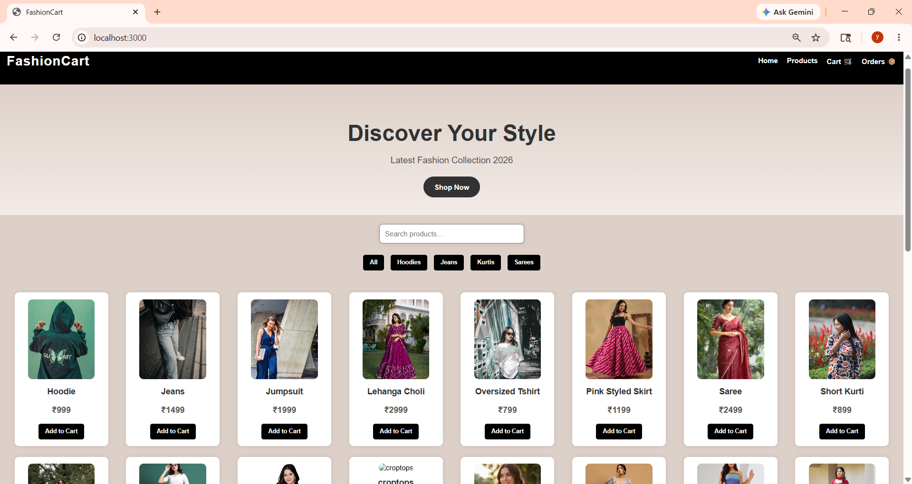
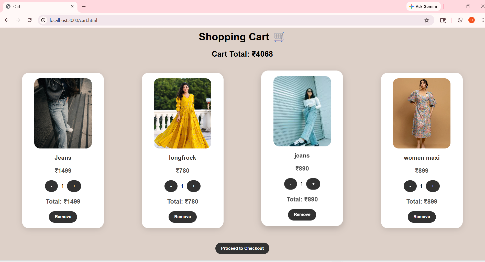
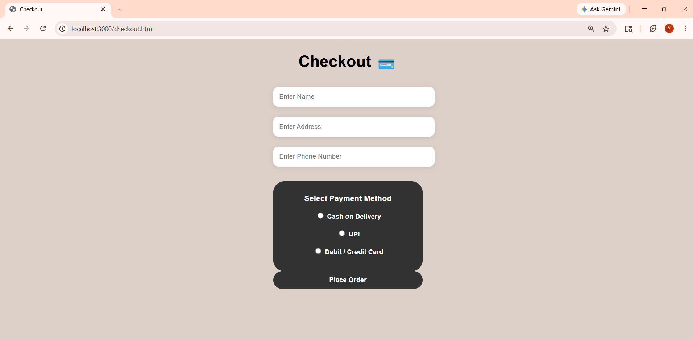

# FashionCart 👗🛒

A clothing-based Fashion eCommerce web application built using HTML, CSS, JavaScript, Node.js, Express.js, and MongoDB.

This project allows users to browse fashion products, add items to the cart, manage quantities, place orders, and view order history through a clean and responsive user interface.

---

# 🚀 Features

- Stylish and responsive fashion UI
- Product listing page
- Add to Cart functionality
- Increase / decrease product quantity
- Remove items from cart
- Checkout page with payment method selection
- Order placement system
- Orders history page
- Product search functionality
- Category filter buttons
- MongoDB database integration
- Backend API using Express.js

---

# 🛠 Technologies Used

## Frontend
- HTML5
- CSS3
- JavaScript

## Backend
- Node.js
- Express.js

## Database
- MongoDB

---

# 📂 Project Structure

```bash
FashionCart
│
├── Backend
│   ├── models
│   ├── public
│   ├── server.js
│   ├── package.json
│   └── package-lock.json
│
├── frontend
│   ├── index.html
│   ├── cart.html
│   ├── checkout.html
│   ├── orders.html
│   ├── admin.html
│   ├── style.css
│   ├── script.js
│   ├── cart.js
│   ├── checkout.js
│   └── orders.js
│
├── README.md
└── .gitignore
```

---

# ⚙️ How to Run the Project

## 1️⃣ Clone Repository

```bash
git clone https://github.com/yamini2123/FashionCart.git
```

## 2️⃣ Open Project Folder

```bash
cd FashionCart
```

## 3️⃣ Install Backend Dependencies

```bash
cd Backend
npm install
```

## 4️⃣ Start the Server

```bash
node server.js
```

## 5️⃣ Open in Browser

```bash
http://localhost:3000
```

---
### Home Page

### Cart page

### Checkout page 

# 👩‍💻 Author

**Yamini**

GitHub: https://github.com/yamini2123